<div align="center">


# ProductivityX Web

**Production-grade productivity platform for the modern web**

[](https://react.dev)
[](https://www.typescriptlang.org)
[](https://vitejs.dev)
[](https://tailwindcss.com)
[](LICENSE)
[](https://github.com/productivityx-app/productivityx_backend)

[Live Demo](https://productivityx.vercel.app) · [Report Bug](https://github.com/productivityx-app/productivityx_web/issues) · [Android](https://github.com/productivityx-app/productivityx_android)

</div>

---

## Overview

ProductivityX Web is the browser-based client for the ProductivityX productivity ecosystem. Built with **React 19**, **TypeScript**, **Vite 6**, and **Tailwind CSS v4**, it delivers a full-featured SPA with a premium design system built on **shadcn/ui** and **Radix UI** primitives.

Every feature is fully implemented — a TipTap-powered rich text editor with Markdown support, kanban boards with drag-and-drop, a calendar with month/week/day/agenda views, a Pomodoro timer backed by a Web Worker for accurate background counting, AI chat with SSE streaming, and a delta sync engine that keeps data synchronized with the server every 30 seconds.

---

## Demo

<div align="center">

[](https://youtu.be/NObpZm4p51Q)

</div>

<div align="center">

[](https://youtu.be/NObpZm4p51Q)

</div>

---

## Screenshot Gallery

<table>
  <tr>
    <td align="center">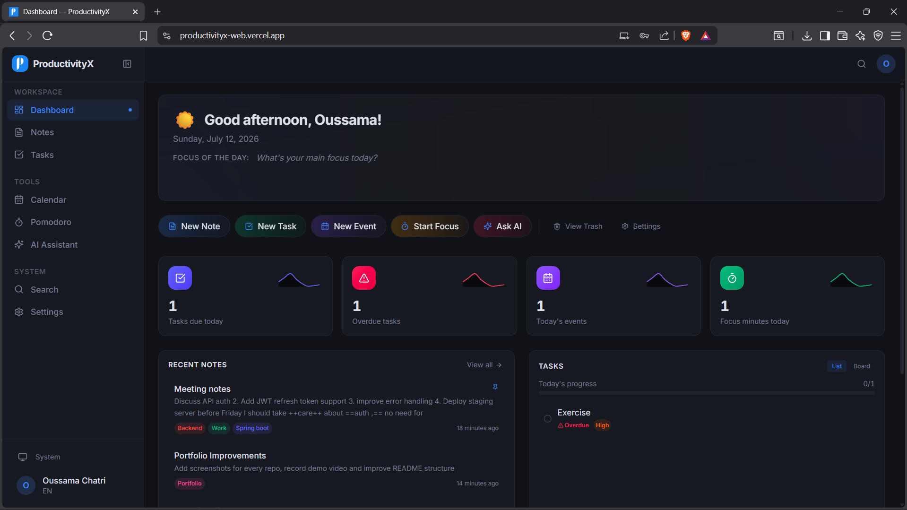<br/><b>Dashboard</b></td>
    <td align="center">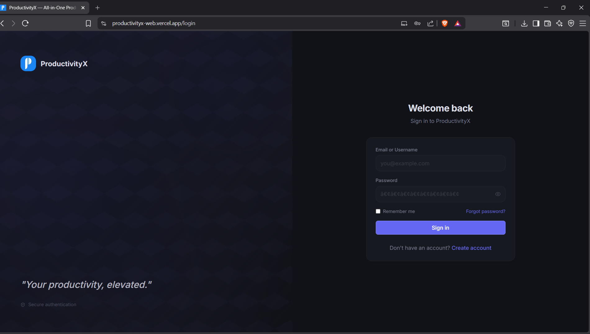<br/><b>Authentication</b></td>
    <td align="center">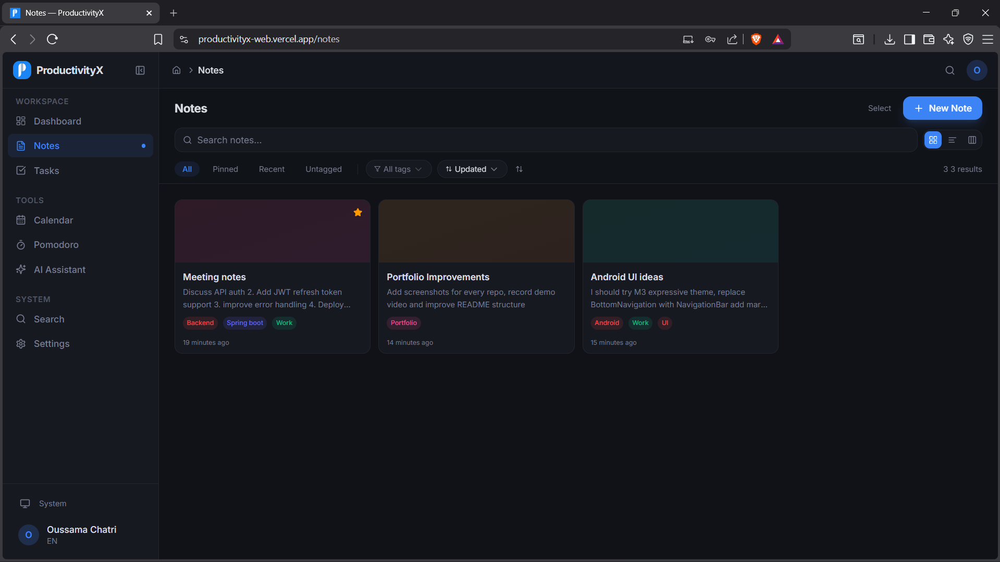<br/><b>Notes Editor</b></td>
  </tr>
  <tr>
    <td align="center">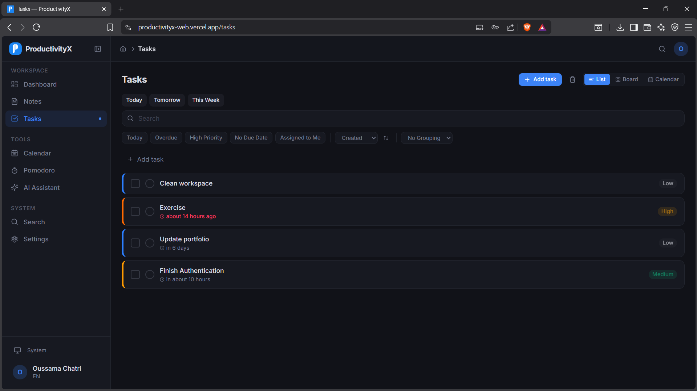<br/><b>Tasks</b></td>
    <td align="center">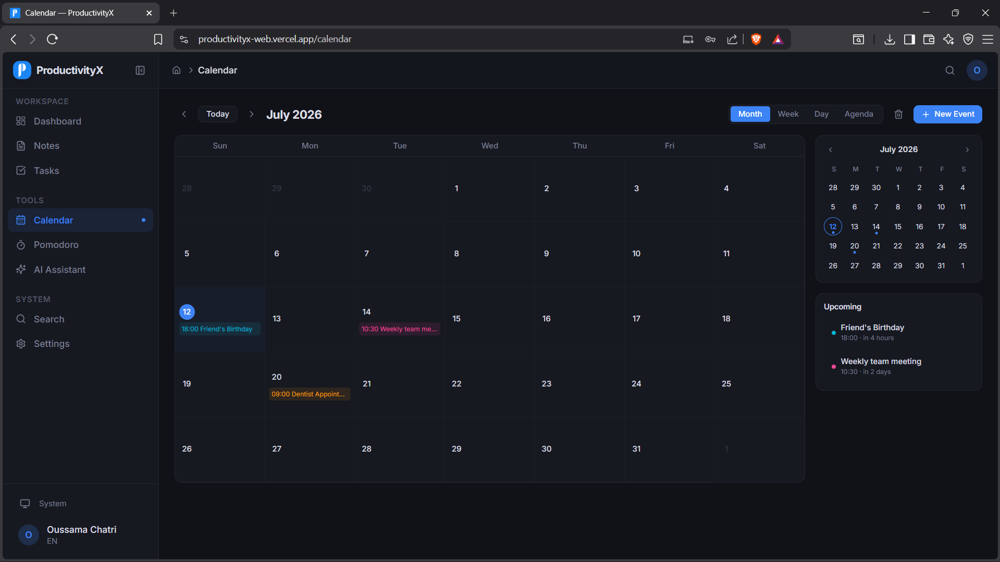<br/><b>Calendar Events</b></td>
    <td align="center">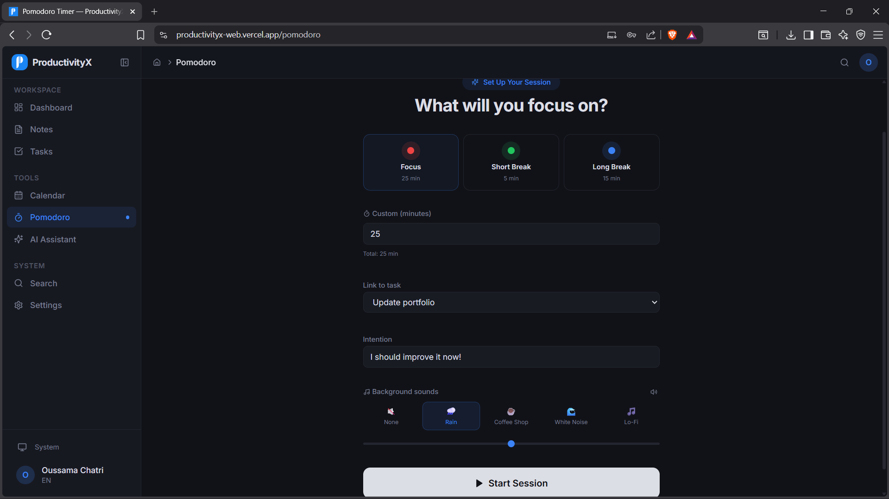<br/><b>Pomodoro Timer</b></td>
  </tr>
  <tr>
    <td align="center"><br/><b>Focus Mode</b></td>
    <td align="center"><br/><b>Session States</b></td>
    <td align="center">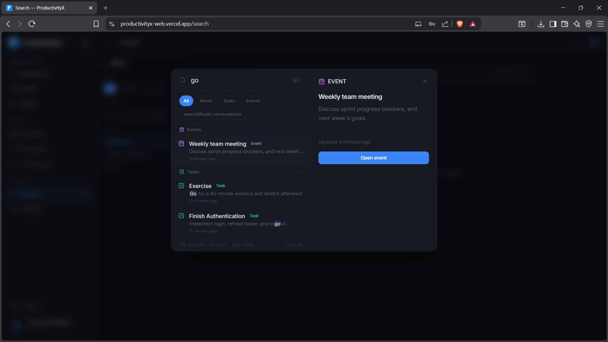<br/><b>Global Search</b></td>
  </tr>
  <tr>
    <td align="center">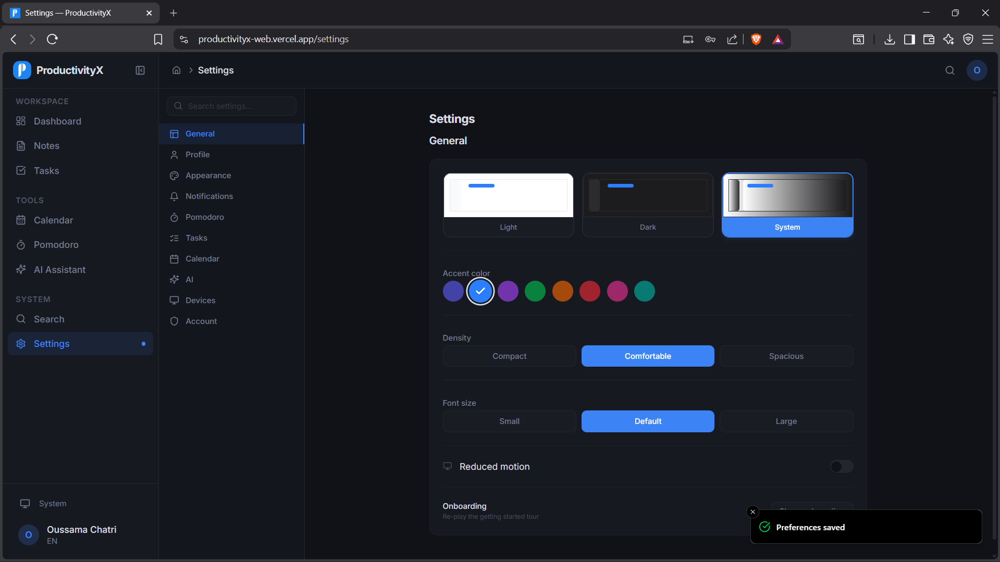<br/><b>Settings</b></td>
  </tr>
</table>

---

## Features

- [x] **Dashboard** — Hero section, stat cards, task/note/calendar/pomodoro widgets, quick actions, focus of the day
- [x] **Notes** — TipTap rich text editor with Markdown, board/grid/list views, tags, pin/unpin, reading progress, word count
- [x] **Tasks** — Kanban board with drag-and-drop, list view, subtasks, priorities, bulk actions, filters, trash & restore
- [x] **Calendar** — Month/week/day/agenda views, mini calendar, event creation popover, recurrence (RRULE), reminders
- [x] **Pomodoro Timer** — Web Worker-based countdown, configurable sessions, ambient sounds, weekly heatmap, achievements
- [x] **AI Assistant** — SSE streaming chat, conversation management, suggestion chips, code block rendering, action blocks
- [x] **Unified Search** — Global search modal (⌘+K), full-text search across notes/tasks/events/conversations
- [x] **Settings** — Theme (dark/light/system), 8 accent colors, font size, density, Pomodoro config, notification prefs
- [x] **Authentication** — Register, login, email verification (OTP + magic link), forgot/reset password, auto token refresh
- [x] **Delta Sync** — Background sync every 30 seconds, sync on visibility change, cursor-based pagination
- [x] **Multi-Language** — 15 languages with browser auto-detection and RTL support
- [x] **Onboarding** — Multi-step guided tour with spotlight tooltips for new users
- [x] **Command Palette** — ⌘+K command palette for quick navigation
- [x] **Responsive Design** — Mobile bottom nav, collapsible sidebar, resizable panels
- [x] **PWA** — Installable as a Progressive Web App

---

## Engineering Highlights

| Capability | Implementation |
|---|---|
| **Rich text editor** | TipTap 3 (ProseMirror) with bubble menu, toolbar, code highlighting (lowlight/prismjs), image/link/table/typography extensions, and Markdown serialization. |
| **Accurate background timer** | Pomodoro countdown runs in a dedicated **Web Worker** (`timer.worker.ts`) so it stays accurate even when the browser tab is throttled. State persisted to localStorage. |
| **Auto token refresh** | Axios interceptor catches 401 responses, queues concurrent requests, refreshes the token transparently, then retries all queued calls. Zero user-visible auth errors. |
| **Dual state management** | Zustand 5 (8 stores) for client state with `persist` middleware. TanStack React Query 5 for server state with 30s staleTime and automatic cache invalidation. |
| **Theme system** | Three-way toggle (dark/light/system) with `prefers-color-scheme` listener. 8 accent colors via CSS custom properties. FOUC prevention with `useLayoutEffect`. |
| **Delta sync** | Custom `useSync` hook runs every 30 seconds + on `visibilitychange`. Cursor-based pagination via `DeltaSyncResponse`. Offline detection with banner notification. |
| **Glassmorphism design** | Custom `.glass` and `.glass-strong` utility classes with backdrop-blur and semi-transparent backgrounds. Smooth 300ms theme transitions. |
| **Performance** | All page components lazy-loaded via `React.lazy()`. Suspense-based loading with skeleton placeholders. Vite 6 for fast HMR and optimized builds. |

---

## Project Statistics

<table>
  <tr>
    <td align="center"><b>~22,400</b><br/>Lines of Code</td>
    <td align="center"><b>236</b><br/>Source Files</td>
    <td align="center"><b>24</b><br/>Pages</td>
    <td align="center"><b>~180</b><br/>Components</td>
  </tr>
  <tr>
    <td align="center"><b>8</b><br/>Zustand Stores</td>
    <td align="center"><b>11</b><br/>Custom Hooks</td>
    <td align="center"><b>12</b><br/>API Services</td>
    <td align="center"><b>15</b><br/>Languages</td>
  </tr>
</table>

| Metric | Value |
|---|---|
| **TSX files** | 194 |
| **TypeScript files** | 41 |
| **CSS files** | 1 (1,187 lines) |
| **Total lines of code** | +30k |
| **Page components** | 24 |
| **shadcn/ui components** | 57 |
| **Feature components** | ~123 |
| **Total components** | ~180 |
| **Zustand stores** | 8 |
| **Custom hooks** | 11 |
| **API service files** | 12 |
| **API endpoints consumed** | 60+ |
| **Supported languages** | 15 |
| **Accent colors** | 8 |
| **Theme modes** | 3 (Dark/Light/System) |
| **NPM dependencies** | 91 |
| **TypeScript strict mode** | Enabled |

---

## Architecture

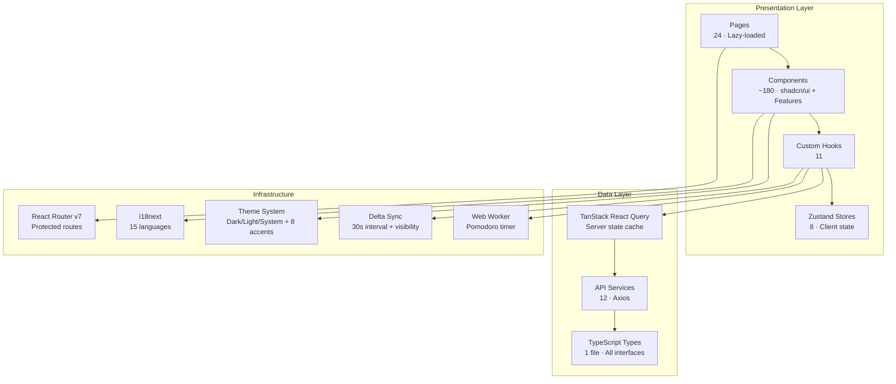

### State Management Strategy

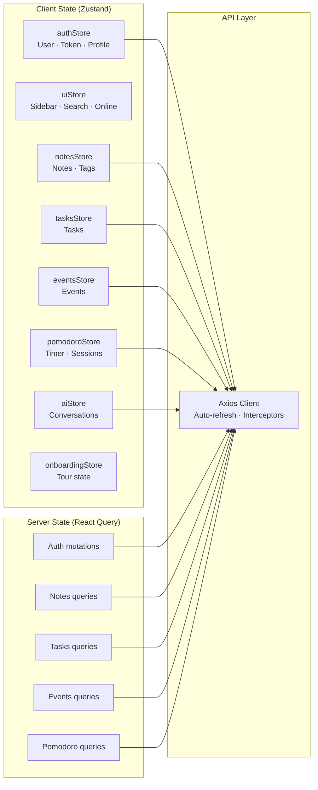

### Component Architecture

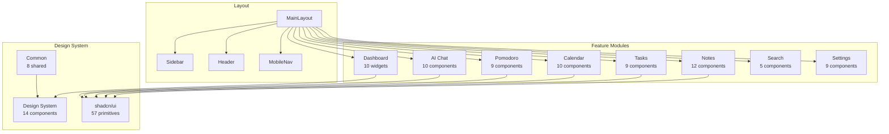

---

## Technology Stack

| Layer | Technology | Version |
|---|---|---|
| **Framework** | React | 19.0.0 |
| **Language** | TypeScript | Strict mode |
| **Build Tool** | Vite | 6.2.0 |
| **Styling** | Tailwind CSS | 4.1.0 |
| **UI Primitives** | Radix UI + shadcn/ui | New York style |
| **Routing** | React Router | 7.18.0 |
| **Client State** | Zustand | 5.0.14 |
| **Server State** | TanStack React Query | 5.60.0 |
| **HTTP Client** | Axios | 1.18.1 |
| **Forms** | react-hook-form + Zod | 7.55.0 / 3.24.0 |
| **Rich Text Editor** | TipTap 3 (ProseMirror) | 3.27.3 |
| **Animation** | Framer Motion | 11.15.0 |
| **Icons** | Lucide React + React Icons | 0.460.0 / 5.4.0 |
| **Charts** | Recharts | 2.15.2 |
| **Drag & Drop** | dnd-kit | 6.3.1 |
| **Date/Time** | date-fns + react-day-picker | 3.6.0 / 9.11.1 |
| **i18n** | i18next + react-i18next | 26.3.3 / 17.0.8 |
| **Theme** | next-themes | 0.4.6 |
| **Command Palette** | cmdk | 1.1.1 |
| **Notifications** | Sonner | 2.0.7 |
| **PDF Export** | html2pdf.js | 0.14.0 |

---

## Folder Structure

```
src/
├── main.tsx                              # Entry point
├── App.tsx                               # Root component · Router setup
├── index.css                             # Global styles (1,187 lines)
│
├── api/                                  # API service layer (12 files)
│   ├── client.ts                         # Axios instance + interceptors
│   ├── auth.ts                           # Authentication endpoints
│   ├── notes.ts                          # Notes CRUD + tags
│   ├── tasks.ts                          # Tasks CRUD + reorder
│   ├── events.ts                         # Calendar events
│   ├── pomodoro.ts                       # Pomodoro sessions + stats
│   ├── ai.ts                             # AI chat (SSE streaming)
│   ├── search.ts                         # Global search
│   ├── tags.ts                           # Tags CRUD
│   ├── profile.ts                        # Profile + preferences
│   ├── sync.ts                           # Delta synchronization
│   └── devices.ts                        # Device management
│
├── components/
│   ├── ai/                               # AI chat (10 components)
│   ├── auth/                             # Authentication (5)
│   ├── calendar/                         # Calendar views (10)
│   ├── common/                           # Shared components (8)
│   ├── dashboard/                        # Dashboard widgets (10)
│   ├── design-system/                    # Design tokens (14)
│   ├── layout/                           # Layout + sidebar (4)
│   ├── notes/                            # Notes + editor (12)
│   ├── onboarding/                       # Guided tour (3)
│   ├── pomodoro/                         # Timer + stats (9)
│   ├── providers/                        # Context providers (1)
│   ├── search/                           # Search modal + page (5)
│   ├── settings/                         # Settings panel (9)
│   ├── tasks/                            # Kanban + list (9)
│   └── ui/                               # shadcn/ui primitives (57)
│
├── hooks/                                # Custom React hooks (11)
│   ├── timer.worker.ts                   # Web Worker for Pomodoro
│   ├── usePomodoroTimer.ts               # Timer logic
│   ├── useSync.ts                        # Background delta sync
│   ├── useTheme.ts                       # Theme management
│   ├── useKeyboardShortcuts.ts           # Global shortcuts
│   ├── useBackgroundSound.ts             # Ambient sounds
│   └── ...
│
├── i18n/                                 # Internationalization
│   ├── config.ts                         # i18next setup
│   ├── dateLocales.ts                    # date-fns locale mapping
│   └── locales/                          # 15 language JSON files
│
├── pages/                                # Page components (24)
│   ├── DashboardPage.tsx
│   ├── NotesPage.tsx / NoteDetailPage.tsx
│   ├── TasksPage.tsx / TaskDetailPage.tsx
│   ├── CalendarPage.tsx / EventDetailPage.tsx
│   ├── PomodoroPage.tsx / PomodoroHistoryPage.tsx
│   ├── AIPage.tsx
│   ├── SearchPage.tsx
│   ├── SettingsPage.tsx
│   └── ... (+ auth pages)
│
├── stores/                               # Zustand stores (8)
│   ├── authStore.ts                      # Auth + profile (persisted)
│   ├── uiStore.ts                        # Sidebar, search, online
│   ├── notesStore.ts                     # Notes + tags
│   ├── tasksStore.ts                     # Tasks
│   ├── eventsStore.ts                    # Events
│   ├── pomodoroStore.ts                  # Timer + sessions
│   ├── aiStore.ts                        # Conversations
│   └── onboardingStore.ts                # Tour state (persisted)
│
├── styles/                               # Style utilities
│   ├── animations.ts
│   └── design-tokens.ts
│
├── types/                                # TypeScript types
│   └── index.ts                          # All interfaces
│
├── config/                               # Configuration
│   └── env.ts                            # API URL resolution
│
├── lib/                                  # Utility libraries
│   ├── animations.ts                     # Framer Motion variants
│   ├── playNotification.ts               # Web Audio notification
│   └── utils.ts                          # cn() utility
│
└── utils/                                # Utility functions
    └── helpers.ts
```

---

## Platform Architecture

### Routing

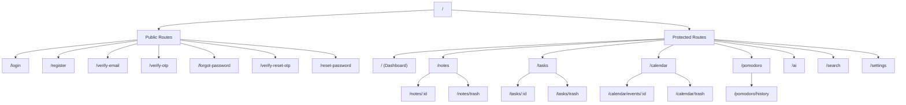

All protected routes require authentication via `ProtectedRoute`. All page components are **lazy-loaded** via `React.lazy()` + `Suspense`.

### Theme System

| Mode | Behavior |
|---|---|
| **Dark** | Forces dark theme (`.dark` class on `<html>`) |
| **Light** | Forces light theme (`.light` class on `<html>`) |
| **System** | Follows `prefers-color-scheme`, updates reactively |

**8 Accent Colors:** Indigo (default), Blue, Purple, Green, Orange, Red, Pink, Teal

**Additional Controls:** Font size (small/default/large), Density (compact/comfortable/spacious)

### i18n Languages (15)

| Language | RTL |
|---|---|
| English, French, Spanish, German | No |
| Korean, Japanese, Portuguese, Turkish | No |
| Traditional Chinese, Hindi, Indonesian | No |
| Vietnamese, Italian, Dutch | No |
| Arabic | **Yes** |

Browser language auto-detected via `i18next-browser-languagedetector`. RTL support via automatic `document.documentElement.dir` switching.

---

## Getting Started

### Prerequisites

- Node.js 18+
- npm or yarn

### Installation

```bash
# Clone
git clone https://github.com/productivityx-app/productivityx_web.git
cd productivityx_web

# Install dependencies
npm install
```

### Development

```bash
npm run dev
```

The dev server starts at `http://localhost:5173` with API and WebSocket proxied to the backend.

### Build

```bash
npm run build
```

Output: `dist/public`

### Preview

```bash
npm run serve
```

### Type Check

```bash
npm run typecheck
```

### Deployment

The app is deployed on **Vercel** with automatic deployments on push to `main`.

```json
{
  "buildCommand": "vite build --config vite.config.ts",
  "outputDirectory": "dist/public",
  "rewrites": [{ "source": "/(.*)", "destination": "/index.html" }]
}
```

---

## Scripts

| Command | Description |
|---|---|
| `npm run dev` | Start development server |
| `npm run build` | Production build |
| `npm run serve` | Preview production build |
| `npm run typecheck` | TypeScript type checking |

---

## Roadmap

- [ ] Collaborative notes (real-time co-editing via WebSocket)
- [ ] Offline mode with local-first caching
- [ ] Drag-and-drop file attachments
- [ ] Calendar import/export (iCal)
- [ ] Task templates
- [ ] Time tracking integration
- [ ] Export to PDF for tasks and notes
- [ ] Keyboard shortcut customization
- [ ] Two-factor authentication (TOTP)
- [ ] Webhook integrations

---

## License

This project is licensed under the **Non-Commercial Source Available License**.

You may view, study, learn from, and modify the source code for personal, educational, research, and evaluation purposes. **Commercial use is strictly prohibited** without prior written permission.

See [LICENSE](LICENSE) for full details.

---

<div align="center">

**Built with precision by [Oussama Chatri](https://github.com/osamachatri)**

[ProductivityX](https://github.com/productivityx-app) · [Android](https://github.com/productivityx-app/productivityx_android) · [Backend](https://github.com/productivityx-app/productivityx_backend) · [Web](https://github.com/productivityx-app/productivityx_web)

</div>
